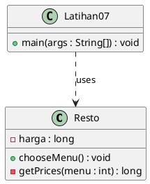
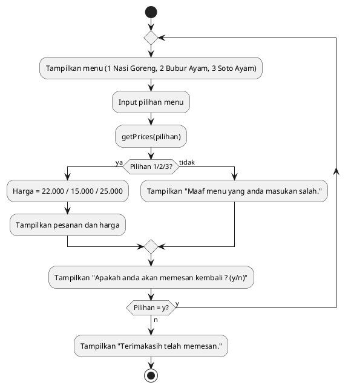

# Soal 8 - Class Diagram (PlantUML)

```plantuml
@startuml
class Resto {
  - harga : long
  + chooseMenu() : void
  - getPrices(menu : int) : long
}
class Latihan07 {
  + main(args : String[]) : void
}
Latihan07 ..> Resto : uses
@enduml
```

# Soal 9 - Activity Diagram (PlantUML)

```plantuml
@startuml
start
repeat
  :Tampilkan menu (1 Nasi Goreng, 2 Bubur Ayam, 3 Soto Ayam);
  :Input pilihan menu;
  :getPrices(pilihan);
  if (Pilihan 1/2/3?) then (ya)
    :Harga = 22.000 / 15.000 / 25.000;
    :Tampilkan pesanan dan harga;
  else (tidak)
    :Tampilkan "Maaf menu yang anda masukan salah.";
  endif
  :Tampilkan "Apakah anda akan memesan kembali ? (y/n)";
repeat while (Pilihan = y?) is (y) not (n)
:Tampilkan "Terimakasih telah memesan.";
stop
@enduml
```
